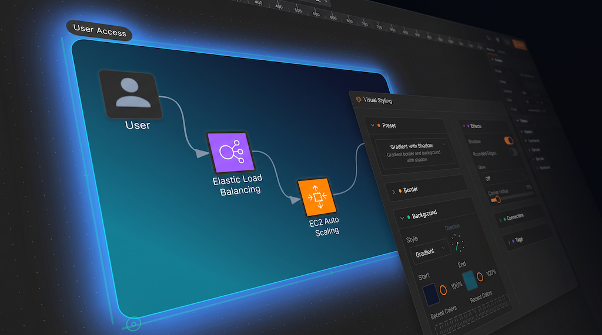
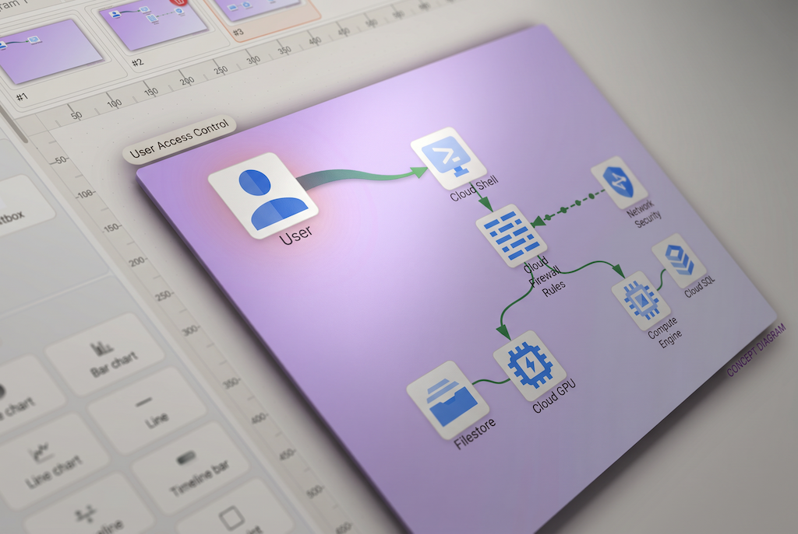
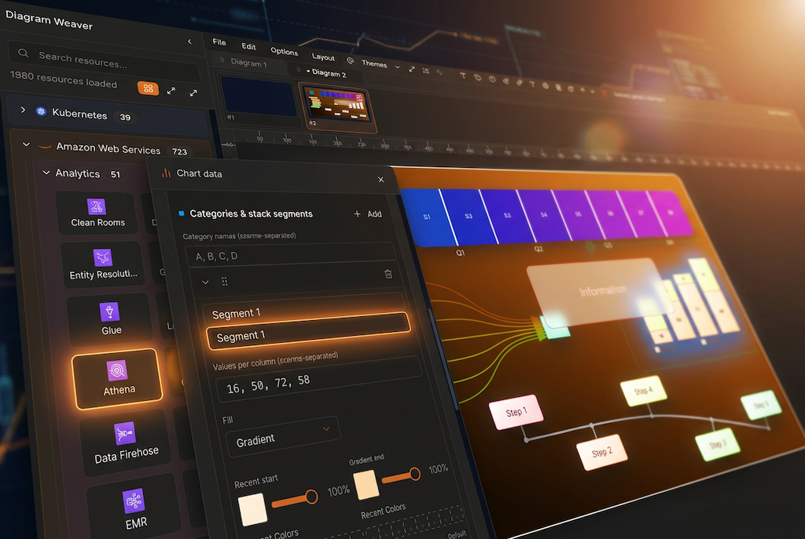
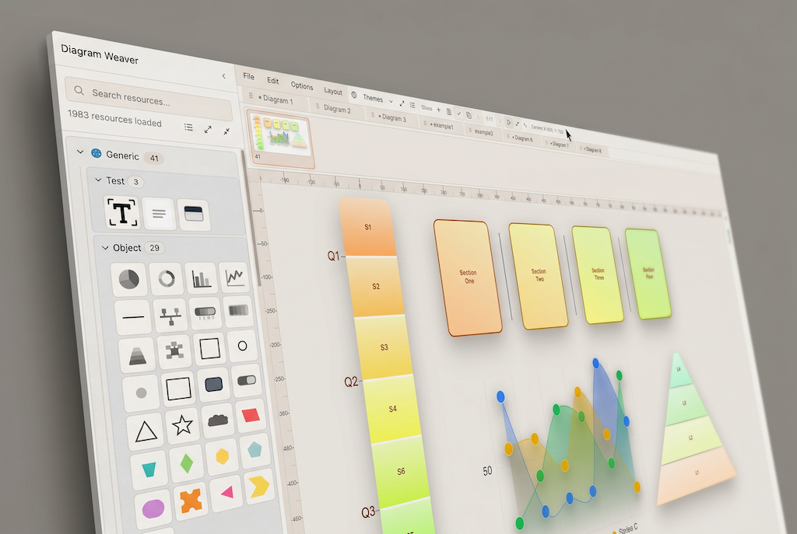
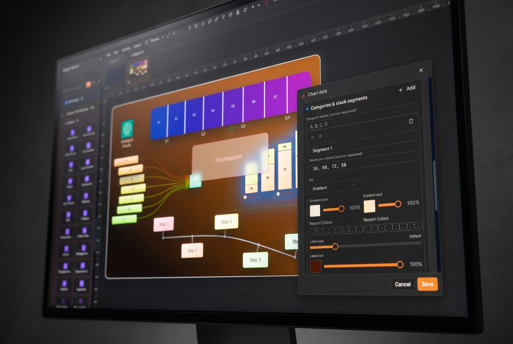

# Diagram Weaver

**Hosted version:** You can try Diagram Weaver in the browser at [https://diagramweaver.com](https://diagramweaver.com).

**Work in progress.** This project is under active development; some functionality may change between releases.

Diagram Weaver: An easy-to-use studio for diagrams and presentations. Pull from a broad library of ready-made icons and shapes—including cloud and tech symbols—to sketch flows and architectures quickly, then step into slides with transitions and animations so decks stay lively without extra tooling. Diagrams stay **interactive**: zoom and pan to explore the canvas; add optional **metadata (“properties”) popups** to show **attributes** and information for whatever you select. When you **present**, combine **Effects** glow highlights with **slide transitions** and **connection animations** so playback can emphasize structure and flows step by step. Whether you’re mapping systems or presenting to an audience, you get polished visuals fast instead of rebuilding layouts by hand.

## Screenshots

Assets live under [`public/marketing/`](public/marketing/) and render below on GitHub.

**Editor canvas** — shapes, resources, and layout on the interactive diagram surface.



**Connections** — curved and orthogonal links with styling and routing.



**Presentations** — decks and slides built from diagram deltas.



**Viewer** — read-only shared view for audiences.



**Teams & access** — collaboration and access controls in the hosted product.



## Tech Stack

- **Language**: TypeScript 5
- **Framework**: Next.js 16.x with React 19.x
- **UI**: Radix UI primitives, TailwindCSS 3.x, shadcn/ui-style patterns
- **Drag & Drop**: `react-dnd` with HTML5 backend
- **Icons**: Lucide React plus provider catalogs (AWS, Azure, GCP, etc.)
- **Editor**: CodeMirror (`@uiw/react-codemirror`) for JSON editing with syntax highlighting and lint hooks

## Features

### Canvas & Editor

- **Interactive Canvas**: Zoom, pan, grid snap (10px) for precise placement; select, drag, connect, and edit objects directly on the diagram
- **Responsive Design**: Mobile-friendly with touch support
- **Fit to View**: Auto-scale canvas to fit all content
- **Undo/Redo**: Full history support (Ctrl+Z / Ctrl+Shift+Z)
- **Multi-Tab**: Create and switch between multiple diagram tabs

### Resource Browser (Left Panel)

- **Searchable Sidebar**: Filter resources by name across all providers
- **Collapsible Panel**: Toggle between full view and narrow strip (48px) with vertical app name
- **Drag-and-Drop**: Drag resources onto the canvas
- **Double-Click Paste**: Add items at viewport center
- **Right-Click Search Modal**: Right-click on empty canvas to open search-resources modal; filter and click or drag items to place
- **Resource Truncation**: Long names truncated with ellipsis; tooltip shows full name on hover

### Resource Categories

| Provider | Description |
|----------|-------------|
| AWS | Amazon Web Services (64 resources) |
| Azure | Microsoft Azure (46 resources) |
| GCP | Google Cloud Platform (38 resources) |
| Kubernetes | K8s resources (24 resources) |
| Generic | Objects, shapes, charts (pie, bar, line), devices, text (resource counts vary by catalog) |
| Programming | Languages, frameworks, flowcharts (75 resources) |
| On-Premise | Servers, databases, monitoring (66 resources) |

Additional providers available (can be enabled): Alibaba Cloud, OCI, SaaS, Elastic, Firebase, DigitalOcean, IBM Cloud, OpenStack, Outscale, GIS.

### Icons Section

- **Lucide Symbols**: 74 icons (Home, Shield, User, Star, Lock, Database, Server, etc.) across 11 categories
- **Emojis**: Standard emoji set for quick visual markers
- **Same Size**: Icons render at 80×80 like other resource items

### Node Types

- **Shapes**: Rectangle, circle, square, triangle, star, cloud, point, trapezoid, parallelogram, hexagon, pentagon, octagon, kite, jigsaw, chevron, arrow, rounded-rectangle
- **Charts** (Generic → Object): **Pie**, **bar**, and **line** chart nodes (`generic.chart.*`) with a **Chart data** editor (series, colors, grids, legend, labels). Drag handles on the canvas adjust values (pie wedges, bar cells, line points); optional **Lock segment values** prevents drag edits while still allowing the modal. See `docs/charts.md`.
- **Line** (standalone connector / polyline, distinct from chart **line** series): Drag endpoints (blue/green handles); insert bend points along the path. Choose **straight** (polyline; optional smoothed corners at vertices) or **curved** (smooth spline through interior points). When start and end meet, geometry **closes** so you can treat it like a filled **custom outline**. Caps (none, arrow, dot, square), thickness, solid/dashed/dotted stroke, color or gradient styling where enabled
- **Textbox**: Rich text with bold/italic/underline and bullet/numbered lists
- **Label**: Text labels with styling
- **Resource Icons**: Cloud provider and on-premise resources with 80×80 icons
- **Lucide Icons & Emojis**: Standard symbols from the Icons section

### Connections

- **Curved & Orthogonal**: Choose **Curved** (bezier) or **Orthogonal** (90° axis-aligned) per connection; toggle via Connection Context Modal, Connections popover, or edge toolbar
- **Connect from multi-selection**: Select multiple **nodes**, start **Connect** (sidebar, context menu, or connect handle), then click the destination—one new connection is created **from each** selected item (self-links skipped; order follows the selection)
- **Taper & gradient**: Optional unlocked **start/end line width** and **start/end color** along a connection (ribbon fill when varying); locks reset to a uniform stroke
- **Connection Animations**: Animated shapes (dot, square, arrow, triangle, hexagon) along connection paths; per-connection shape, speed, size, spacing; bulk apply outbound/inbound
- **Per-Connection Controls**: Arrow toggle, color picker, text label, text position (0–100%), line thickness, shadow
- **Waypoints**: Add waypoints to route bezier connections around obstacles (Curved only)
- **Direction Indicators**: Preferred exit/entry directions
- **Connection Order**: Lines respect z-order (Move to Front/Back affects layering)
- **Connections Panel**: Popover on Connections button; per-connection controls when node selected

### Selection & Multi-Select

- **Single Select**: Click to select node or connection
- **Shift+Click**: Add/remove from selection
- **Selection Box**: Drag on empty canvas to draw rectangle; items within selected
- **Multi-Drag**: Drag multiple selected items together; relative positions preserved

### Groupings

- **Create Group**: Select 2+ nodes → Create grouping for coordinated movement
- **Auto Layout**: Groupings move as blocks in auto-layout
- **Add/Remove**: Add nodes to grouping or remove from grouping

### Sub-diagrams

- **Nested diagrams**: A node can link to a **sub-diagram** (separate canvas scoped under the main file’s `subDiagrams` data). Open it by **double-clicking** the node when it has a linked sub-diagram.
- **Breadcrumb trail**: A bar under the header shows **Home** (root) and each drilled level, separated by chevrons. Click any earlier segment to jump back to that level without losing the stack. In the editor, breadcrumb labels can be **renamed** (where supported) so the trail matches how you think about the hierarchy.

### Styling & Layout

- **Themes** (toolbar **Themes** menu): Browse presets (**Favorites** and **All Themes**), apply a theme to the **current selection** (nodes and connections), and star themes you reuse often. Open **Theme Editor** from the menu to create, edit, import, or manage custom themes.
- **Bulk hue when multi-selected**: In the Themes menu, enable **Step hue for multi-selection** and set **Hue step (°)**. Applying a theme then shifts colors **per selected item** by successive hue increments along canvas reading order—primarily **top-to-bottom** when the selection is taller than wide, otherwise **left-to-right**—so a group stays harmonious but not identical.
- **Visual Styling Panel**: Shapes/textbox borders and backgrounds (shadow, tags); **background fill** modes — **Solid**, **Gradient** (angle-controlled), or **Frosted glass** (blurred backdrop through the shape with diffusion/transparency—and optional noise—where enabled); Lucide icons (color, remove background); resource items (remove background)
- **Highlight animation** (Effects): Optional repeating **glow** on nodes with duration, interval, and color; staggered wave across the canvas (top-down). Respects **reduced motion** and disables for GIF export when appropriate
- **Text Styling Panel**: Justification (left, center, right, full), vertical position (top, middle, bottom); optional **text outline**, **glow**, and **drop shadow**; font size up to **200px**
- **Line Styling Panel**: Start/end caps, thickness (0.5–10px), stroke paint (for connector-line nodes—includes closed/custom-outline fills); optional text **shadow** toggle and outline/glow where applicable
- **Rotation**: 0°, ±45°, ±90° for nodes; interactive corner rotation handles
- **Resize Handles**: Edge and corner handles for shapes, textboxes, groups

### Alignment & Layout

- **Align**: Left, Center (H), Right, Top, Middle (V), Bottom
- **Distribute**: Horizontally, vertically
- **Auto Layout**: Hierarchical layered layout (Ctrl+Shift+L); minimizes crossings, preserves groupings

### JSON Editor Panel

- **Live Sync**: Bidirectional sync between canvas and JSON
- **CodeMirror**: Line numbers, syntax highlighting, bracket matching, validation
- **Find**: Search in the JSON text (case-sensitive option, prev/next, counts); **Enter** / **Shift+Enter** to navigate matches
- **Jump to selection**: With the panel open, selecting a node or connection on the canvas scrolls the matching JSON block into view (start of block aligned in the viewport)
- **Keyboard Shortcut**: Ctrl+Shift+J (Cmd+Shift+J on Mac) to toggle
- **Type Expansion**: Abbreviated types (e.g. `aws.c.ec2`) expand to full form
- **Resizable**: Collapsible panel with localStorage persistence

### Mermaid Import

- **Import Mermaid**: File → Import Mermaid or File → Load (.mmd, .mermaid files)
- **Supported types**: Flowchart, class diagram, sequence diagram
- **Flowchart**: Node shapes (rect, rounded, circle, diamond, hexagon, parallelogram, trapezoid, etc.), connectors with labels, directions TD/LR/BT/RL, YAML frontmatter for layout (dagre/elk)
- **Class diagram**: UML-style classes (name, attributes, methods), inheritance (`Parent <|-- Child`)
- **Sequence diagram**: Participants as rounded-rectangles, messages as lines, self-loops as loop shapes
- **Examples**: File → Examples → Mermaid Simple / Mermaid Complex / Mermaid Class Diagram / Mermaid Sequence Diagram
- **Validation**: `npm run validate-mermaid` or `GET /api/validate-mermaid` when dev server running

See `docs/MERMAID-IMPORT.md` for full syntax and mapping.

### Export & Persistence

- **Export PNG/GIF**: Viewport export via html-to-image; GIF supports animated connection lines (duration, FPS, background)
- **Save/Load**: JSON file save and load (JSON + .mmd/.mermaid)
- **Copy Viewer URL**: Shareable URL for read-only viewer
- **Examples**: Built-in example diagrams (File → Examples)

### Presentation mode

- **Decks & slides**: Build **presentation decks** where each **slide** stores a **diagram delta** (and optional layer visibility and connection-animation state) on top of the diagram
- **Edit vs play**: Edit deck structure and slide content in the editor; **play** fullscreen with slide transitions (nodes, layers, connections—including chart segment staggers and connection timing)
- **Emphasis**: Slide transitions reveal or move diagram elements between slides; pair them with **Effects** highlight glow on nodes (optional stagger across the slide) and **connection animations** so presentations can progressively spotlight structure and flows—without replacing spoken narrative
- **Docs**: See `docs/PRESENTATION-MODE.md` for the data model and behavior

### Viewer

- **Read-Only Mode**: Share diagrams via URL without editing (File → Copy Viewer URL)
- **URL Parameters**: `?json=` (base64-encoded diagram) or `?url=` (URL to fetch JSON from a remote host)
- **Controls**: Zoom in/out, Fit to View, Properties panel toggle, metadata popup toggle, animation toggle
- **Connection Animations**: Same animated shapes as editor; Show animations for selected only (downstream chain)
- **Selection**: Click nodes or connections to view name, type, and metadata in the Properties panel
- **Metadata Popups**: After selecting an item that has **`metaData`**, a compact **attributes** popup sits beside it (toggle in controls); **hover the popup** to expand truncated rows or scroll longer lists
- **Layers Panel**: When diagram has 2+ layers, toggle layer visibility (eye/eye-off)
- **Limits**: 5MB JSON max; 10s timeout for remote `url=` fetch

### View Options

- **Dark/Light Mode**: System-wide theme toggle (Light, Dark, System); persisted to localStorage
- **Layers Panel**: Toggle layer visibility
- **Scratch Pad**: Notes area
- **Lines Behind Nodes**: Toggle connection line layering (behind nodes vs order-aware interleaving)
- **Animation Connections**: Toggle animated shapes on connections (Ctrl+Alt+A). The toolbar **Activity** control mirrors this; animations also **pause** after ~**20s** of no pointer movement on the canvas (resumes on move) and while **menu** / **context** / **modal** UI is open over the canvas—without changing your saved preference
- **Hover Text**: Toggle node labels on hover
- **Icon Background**: Toggle background on resource icons
- **Alignment Guides**: Snap guides when dragging
- **Read-Only Mode**: Disable editing

### Rules Engine

- **Edit → Rules**: Define validation rules for diagram content; pass (✓) or fail (✗) per rule
- **Operators**: Must have at least 1, at least N, more than N, exactly N, or must have all types
- **Type Matching**: Exact (searchable dropdown) or pattern with substring/`*` wildcard (e.g. `firewall` or `aws.database.*`)
- **Export/Import**: Save rules to JSON file (native Save As dialog in Chrome/Edge); import from file
- **Persistence**: Rules stored in localStorage and survive browser refresh
- **Optional**: Diagrams work without rules; rules are user-defined checks only

### Metadata

- **`metaData`**: Optional key/value pairs (e.g. `"IP Address": "192.168.1.1"`) on nodes, connections, and groupings
- **Properties Panel**: Right panel shows selected item name, type, and metadata; add/edit/remove via UI (Edit → Toggle Properties)
- **Metadata Popup**: Anchored beside the selected node or connection when **`metaData`** exists; hover the popup to expand clipped values—enable via **Edit → Enable Properties** (or viewer toolbar toggle)
- **Key Suggestions**: Input suggests previously used keys across the diagram for consistent property names
- **JSON Storage**: Stored in diagram JSON as `metaData: { "Key": "value", ... }`; export/import preserves metadata
- **Viewer**: Properties panel and popup available in read-only mode

### Theme

- **Theme Selector**: Apply themes to selected items
- **Theme Editor**: Customize colors, borders, gradients
- **Theme Menu**: Quick theme application from toolbar (**View → Themes**); enable **Step hue for multi-selection.** to apply a progressive hue shift across the current multi-selection (order follows layout: top-to-bottom or left-to-right)
- **Built-in presets**: Expanded built-in color presets (see app menu for current list); theme rows can show a **description** tooltip after a short hover delay

### Other

- **Tutorial**: In-app tutorial overlay (File → Start Tutorial)
- **About Dialog**: App **version** and project info (**Help → About**). The main header no longer shows a live version/build chip
- **Sequential IDs**: New nodes get IDs like `aws-database-dynamodb-1`, `grouping-2`
- **Palette Copy/Paste**: Select resource in sidebar → Copy → Paste to add at center

## Keyboard Shortcuts

| Shortcut | Action |
|----------|--------|
| Ctrl+N | New diagram |
| Ctrl+O | Load |
| Ctrl+S | Save |
| Ctrl+C | Copy |
| Ctrl+V | Paste |
| Ctrl+A | Select All |
| Ctrl+Z | Undo |
| Ctrl+Shift+Z | Redo |
| Ctrl+0 | Fit to View |
| Ctrl+Shift+J | Toggle JSON panel |
| Ctrl+Shift+L | Auto Layout |
| Ctrl+Alt+A | Toggle connection animations |
| Ctrl+Alt+C | Toggle click-to-show animations |
| Delete / Backspace | Delete selected |
| Escape | Clear selection |

## Performance

DiagramWeaver includes several performance optimizations to ensure smooth rendering, especially for large diagrams:

### Rendering Optimizations
- **Component Memoization**: Key components (ConnectionWaypointHandles, OrthogonalConnection) use React.memo to prevent unnecessary re-renders
- **Handler Optimization**: 31+ handler functions wrapped in useCallback to reduce child component re-renders by 60-80%
- **Image Caching**: Smart image caching with 1-hour expiration and 100-image limit reduces network requests by 70-90%

### Load Time Optimizations
- **Code Splitting**: Large panels (Properties, Layers, JSON Editor, Presentation Editor) are lazy-loaded, reducing initial bundle size by 53KB
- **Lazy Image Loading**: Images only load when they enter the viewport, improving initial page load by 20-30% for diagrams with 10+ images

### Performance Improvements by Diagram Size
- **Small diagrams (1-10 nodes)**: No noticeable difference
- **Medium diagrams (11-50 nodes)**: 10-15% faster rendering
- **Large diagrams (51-100 nodes)**: 15-25% faster rendering
- **Very large diagrams (100+ nodes)**: Up to 40% faster rendering (with viewport culling when integrated)

### Tips for Best Performance
- For very large diagrams, use zoom to focus on specific areas
- Enable "Lines Behind Nodes" to reduce re-rendering overhead
- Keep diagrams modular by using groupings
- Close unused panels to reduce memory usage

## Accessibility

DiagramWeaver is designed with accessibility in mind and follows WCAG 2.1 Level AA guidelines:

### Keyboard Navigation
- Full keyboard support for all major operations
- Focus management in modals and dialogs
- Tab navigation properly trapped within modals
- Escape key closes dialogs and clears selections

### Screen Reader Support
- All icon-only buttons include `aria-label` attributes
- Semantic HTML elements used throughout
- Form labels properly associated with inputs
- ARIA roles and attributes appropriately applied

### Accessibility Statistics
- 69 ARIA labels for icon-only buttons
- 86 focus management instances
- 42 keyboard event handlers
- 330 Tooltip components for additional context
- 422 Dialog components with built-in accessibility
- 1,023+ accessibility elements across 10 categories

### Accessibility Features
- **Consistent Keyboard Shortcuts**: Standard shortcuts for common operations (Ctrl+C, Ctrl+V, Ctrl+Z, etc.)
- **Focus Indicators**: Clear visual indication of focused elements
- **Color Contrast**: Colors meet WCAG AA contrast requirements
- **Error Messages**: Clear error feedback for invalid operations
- **Skip Links**: (Future enhancement) For keyboard navigation to main content

For detailed accessibility audit results, see [`docs/ACCESSIBILITY_AUDIT_REPORT.md`](docs/ACCESSIBILITY_AUDIT_REPORT.md).

## Development

### Build Commands

- `npm run dev` – Start dev server (port 9003)
- `npm run build` – Production build
- `npm run lint` – Run ESLint
- `npm run typecheck` – TypeScript type check

### Resource Management

Single source of truth: `public/resources/`

- All resource JSON files and icons are served from `public/resources/*`
- Resource Browser fetches index from `/resources/resource-components.json` and provider files from `/resources/*.json`
- Canvas uses the same icon paths via `imagePath` from the browser into node data
- **No separate source directory or sync step** – update JSON files directly under `public/resources/`

See detailed guide: `docs/RESOURCES.md`

### Getting Started

1. Start the development server: `npm run dev`
2. Edit resource files in `public/resources/`
3. Reload the app; changes appear in the Resource Browser

### Project Structure

Repository layout (high level):

```
.
├── docs/           # Guides, benchmarks, accessibility audit, plans
├── public/         # Static assets served by Next.js (`/examples`, `/resources`, …)
├── scripts/        # Node helpers (semver/build bumps, validators, …)
├── resources/      # Optional templates / tooling beside `public/` (canonical icons live under `public/resources/`)
├── src/            # Application source (Next.js App Router)
├── AGENTS.md       # Contributor/agent notes for this repo
├── MEMORY.MD       # Implementation history notes
├── package.json
└── …               # Config (`next.config.ts`, `tailwind.config.ts`, `tsconfig.json`, …)
```

`src/` layout:

```
src/
├── app/                  # Routes: `/` (editor), `/viewer`; API handlers under `app/api/*`
├── components/
│   ├── diagram-editor.tsx          # Editor shell / wiring (large orchestrator)
│   ├── diagram-editor-inner.tsx    # Layout chrome around the canvas
│   ├── diagram/                    # Nodes, shapes, connections (canvas rendering)
│   ├── editor/                     # Canvas, browser, panels, presentation UI
│   ├── viewer/                     # Read-only viewer canvas and controls
│   ├── tutorial/                   # Tutorial overlay
│   └── ui/                         # Shared primitives (shadcn/ui-style)
├── hooks/                # React hooks (canvas transform, tabs, persistence, …)
├── lib/                  # Types (`types.ts`), schemas, themes, exporters, layout (`diagram-editor/` helpers)
└── types/                # Ambient `.d.ts` stubs for libraries without bundled typings
```

Diagram domain types live in **`src/lib/types.ts`** (not under `src/types/`, which holds ambient declarations only). Root-level shells under **`components/`** also include **`theme-provider.tsx`** and **`theme-toggle.tsx`** (alongside **`diagram-editor.tsx`** / **`diagram-editor-inner.tsx`**).

## License

This project is licensed under the **GNU General Public License v3.0** (GPL-3.0). See [`LICENSE.txt`](LICENSE.txt) for the full license text.
