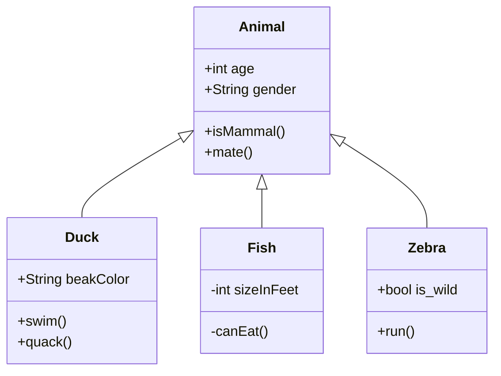

# Mermaid Class Diagram Import Plan

## Goal

Support Mermaid `classDiagram` syntax in addition to existing `flowchart` support. Class diagrams produce UML-style class boxes (name, attributes, methods) with inheritance relationships. **Do not break existing flowchart import.**

## Mermaid Class Diagram Syntax (reference)

- **Header**: `classDiagram`
- **Inheritance**: `Parent <|-- Child` (arrow from child to parent)
- **Members (colon syntax)**: `ClassName : +int age`, `ClassName: +methodName()`
- **Members (block syntax)**: `class ClassName{ attribute\smethod ... }`
- **Visibility**: `+` public, `-` private, `#` protected, `~` package

## Diagram Representation in DiagramWeaver

- **Classes**: Simple rectangles (`generic.object.rectangle`) with multi-line labels:
  - Line 1: Class name
  - Lines 2+: Attributes (e.g. `+int age`)
  - Lines N+: Methods (e.g. `+isMammal()`)
- **Inheritance**: Connections from child to parent, arrow at parent (`toArrow`), straight lines
- **Layout**: Parent above, children below, horizontally aligned (TD-style)

## Implementation Plan

### Phase 1: Parser (mermaid-parser.ts)

1. Add `ParsedMermaidClassDiagram`, `MermaidClassNode`, `MermaidClassEdge` types
2. Add `parseMermaidClassDiagram(text: string)` function
3. Do **not** modify `parseMermaidFlowchart` — keep it unchanged
4. Add `detectMermaidDiagramType(text: string): 'flowchart' | 'classDiagram' | null` for routing

### Phase 2: Converter (mermaid-to-diagram.ts)

1. Add `classDiagramToDiagramData(parsed: ParsedMermaidClassDiagram): Promise<DiagramData>`
2. Each class → one rectangle with label = name + attributes + methods (newline-separated)
3. Inheritance edges → connections from child to parent with toArrow
4. Use `computeMermaidLayout` with TD direction for class hierarchy (parent rank above children)

### Phase 3: Integration (diagram-editor.tsx)

1. In `handleMermaidFileChange`: call `detectMermaidDiagramType`, route to parser/converter
2. In `handleFileChange` (Load): extend `isMermaid` to also detect `classDiagram`, route accordingly
3. In `handleLoadExample`: support `classDiagram` example (e.g. `class-diagram` or reuse existing mmd filename)
4. Error messages: distinct for flowchart vs class diagram

### Phase 4: Example & Validation

1. Add `class-diagram.mmd` to `public/examples/` (copy/rename from Untitled diagram)
2. Add "Mermaid Class Diagram" to File → Examples menu
3. Update validation API/script to accept classDiagram (optional, can skip initially)

## Key Files

| File | Changes |
|------|---------|
| `src/lib/mermaid-parser.ts` | Add class diagram parser + type detection |
| `src/lib/mermaid-to-diagram.ts` | Add classDiagramToDiagramData |
| `src/components/diagram-editor.tsx` | Detect type, route to correct parser/converter |
| `src/components/editor/top-menu-bar.tsx` | Add Class Diagram example menu item |
| `public/examples/class-diagram.mmd` | Example file |
| `MEMORY.MD` | Document new capability |

## Non-Goals (this phase)

- Other Mermaid diagram types (sequence, state, etc.)
- Export to Mermaid (planned separately)
- Class diagram–specific styling (e.g. compartment dividers) — simple rectangles only
- Relationship types beyond inheritance (`<|--`)

## Validation

1. Import `Untitled diagram-2026-02-24-081051.mmd` via File → Import Mermaid → should render Animal, Duck, Fish, Zebra with inheritance
2. Load same file via File → Load → same result
3. Load via File → Examples → Mermaid Class Diagram → same result
4. Existing flowchart examples (simple.mmd, complex.mmd) continue to work unchanged
