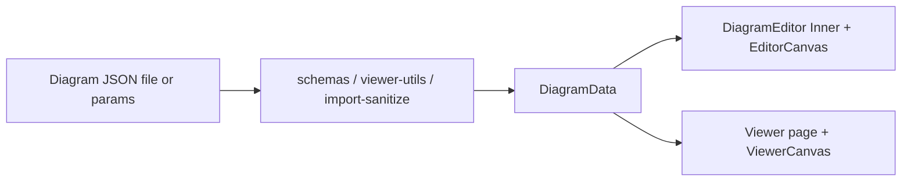

# Functional architecture (`functional.md`)

This document describes **how Diagram Weaver’s code is structured**: main modules, what they are responsible for, and how data and UI connect. Use it alongside **`AGENTS.md`** (canvas/viewer/presentation rendering notes), **`MEMORY.MD`** (dated change history), and **`README.md`** (features and project layout).

---

## Mental model

1. **`DiagramData`** (see `src/lib/types.ts`) is the serializable diagram: nodes, connections, groupings, optional layers/view state, zones, sub‑diagrams, presentations.
2. **Validation** converts arbitrary JSON → **`DiagramData`** via **`DiagramDataSchema`** (`src/lib/schemas.ts`) and helpers in **`viewer-utils`** / **`import-sanitize`** / **`flatten-on-import`**.
3. **Editor shell** (`DiagramEditor` → `DiagramEditorInner` → **`EditorCanvas`**) mutates **`DiagramData`** (tabs, history, undo, presentation authoring).
4. **Viewer shell** (`/viewer`) loads JSON (inline URL, remote URL, or file), runs the same validation path, renders **`ViewerCanvas`** read‑only.
5. **Rendering** shares **`CanvasConnections`** with **`BezierConnection`** / **`OrthogonalConnection`** and **`DiagramNode`**‑backed shapes so editor and viewer match.

---

## Application routes (`src/app/`)

| Route / file | Role |
|--------------|------|
| **`page.tsx`** | Loads **`DiagramEditor`** — main authoring UI at **`/`**. |
| **`layout.tsx`** | App shell (fonts, providers, etc.). |
| **`viewer/page.tsx`** | **`/viewer`**: parses query params (**`viewer-utils`** `parseViewerParams`), **`loadViewerData`** or local file picker, **`ViewerCanvas`** + optional **`PresentationPlayer`**. |
| **`api/export/route.ts`** | Server‑side diagram export (**`server-export`**, validates diagram JSON). |
| **`api/validate-mermaid/route.ts`** | Validates Mermaid text for import flows. |
| **`api/validate-image-url/route.ts`** | Validates remote image URLs (custom icons). |
| **`icon.tsx`** | App icon metadata for Next.js. |

**`actions.ts`** is a minimal server-actions stub (no diagram logic).

---

## Core types & validation

| Module | Responsibility |
|--------|----------------|
| **`lib/types.ts`** | Domain **`interface`**/`type` definitions: nodes (including charts, connector lines), connections, deltas, **`LayersConfig`**, **`PresentationDeck`**, **`DiagramData`**. |
| **`lib/schemas.ts`** | **`zod`** **`DiagramDataSchema`**, hierarchical variants, **`parseDiagramJson`** (flatten + parse + sanitise), coercion consistent with persistence. **`ensureDiagramLayersPersisted`** is applied where layers must exist on disk. |
| **`lib/viewer-utils.ts`** | **`validateAndConvertJson`** (hierarchical ↔ flat via nested helpers), **`viewerDataFromUnknownJson`**, **`loadViewerData`**, **`parseViewerParams`**, **`normalizeViewerPresentation`** — single entry behaviour for `/viewer`. |
| **`lib/import-sanitize.ts`** | **`sanitizeImportedDiagram`**, ID collection/checks across imports. |
| **`lib/flatten-on-import.ts`** | **`flattenDiagramOnImport`** for zone/nested payloads before strict schema parse. |
| **`lib/layers-utils.ts`** | **`validateLayersConfig`**, **`filterByVisibleLayers`**, **`ensureDiagramLayersPersisted`**, reorder/rename helpers — layers are part of **`diagramData`**. |

---

## Editor composition (`src/components/`)

| Piece | Responsibility |
|-------|----------------|
| **`diagram-editor.tsx`** | Large orchestrator: tabs (**`useDiagramTabs`**), **`useLayers`**, **`useDiagramEditorHistory`**, Mermaid/custom icon/Mermaid parsing, **`presentation-slide-chain`** (deltas between slides), deck merge/storage, breadcrumbs/sub‑diagram stack, save/export handler wiring, keyboard rules. |
| **`diagram-editor-inner.tsx`** | Layout: toolbars, side panels, **`EditorCanvas`**, presentation UI, properties, JSON panel — props bridge from **`diagram-editor`**. |
| **`editor/editor-canvas.tsx`** | Interactive SVG canvas: transforms (**`useCanvasTransform`**), **`DiagramNode`**, **`CanvasConnections`**, selection, clipboard, guides, connectors, grouping affordances — mirrors viewer behaviour with editing hooks. |
| **`viewer/viewer-canvas.tsx`** | Read‑only canvas; passes **`isReadOnly`** through connections — same **`CanvasConnections`** / connection components as the editor. |
| **`editor/canvas-connections.tsx`** | Sorts/z‑orders connections, branches **Bezier** vs **orthogonal** routing props, animations, waypoint editing (editor paths). |

**Shapes** live under **`components/diagram/shapes/`** and are invoked from **`diagram-node.tsx`**.

---

## Hooks (`src/hooks/`) — how behaviour is split out

Grouping by concern (each file encapsulates **`use*`** logic used by **`diagram-editor`** or canvas):

| Concern | Hooks |
|---------|--------|
| **Tabs & bootstrap** | **`use-diagram-tabs`**, **`use-diagram-editor-client-bootstrap`**. |
| **Canvas transforms & fit** | **`use-canvas-transform`** (`handleFitToView`, scale/pan consistent with thumbnails and presentation union fit). |
| **Pointer / gestures** | **`use-canvas-interactions`**, **`use-canvas-drag-drop`**, **`use-canvas-selection`**, **`use-alignment-guides`**, **`use-canvas-context-menu`**. |
| **Clipboard & export surface** | **`use-canvas-clipboard`**, **`use-canvas-export`**. |
| **History** | **`use-diagram-editor-history`** (debounced snapshots; defers during drags). |
| **Keyboard** | **`use-diagram-editor-keyboard`**. |
| **Layers** | **`use-layers`** (visibility, order, optional global apply for presentation). |
| **Presentation** | **`use-presentation-thumbnails`**, **`use-presentation-slide-viewport-sync`**, **`use-presentation-tab-switch-sync`**, **`use-presentation-storage-hydration`**, **`use-presentation-slide-view`**, **`use-slide-transition`**. |
| **Connection animation** | **`use-connection-animation-idle`**, **`use-sine-wave-animation`**. |
| **Rules / scratch** | **`use-diagram-editor-rules-scratch-layer-effects`**. |
| **Options & UI** | **`use-diagram-editor-option-persistence`**, **`use-toolbar-trigger-auto-reset`**, **`use-toast`**, **`use-mobile`**, **`use-resource-types`**, **`use-svg-gradient`**. |

---

## Library modules (`src/lib/`) — functional map

Below, “**key exports**” are representative; open the file for the full surface.

### Diagram graph & layout

| Module | Key ideas |
|--------|-----------|
| **`grouping-utils.ts`** | **`createGroup`**, **`addToGroup`**, **`removeFromGroup`**, **`ungroup`**, **`getGroupMembers`**, deletion cleanup. |
| **`group-hierarchy.ts`**, **`nested-hierarchy.ts`**, **`pure-hierarchy.ts`**, **`sub-diagram-utils.ts`** | Hierarchy for zones/sub‑diagrams; **`getDiagramAtStack`** / **`updateDiagramAtStack`** for breadcrumb drilling. |
| **`auto-layout.ts`** | **`performAutoLayout`** — layered layout invocation. |
| **`rendering-order-utils.ts`** | Z‑order: front/back/move one step (**`diagram-editor`** toolbar). |
| **`z-order-list-utils.ts`**, **`connection-order-utils.ts`** | Stable ordering helpers; **`generateConnectionId`**, **`ensureConnectionIds`**, selection predicates. |
| **`adjacency-utils.ts`** | Connection adjacency for tooling. |

### Connections geometry & styling

| Module | Key ideas |
|--------|-----------|
| **`orthogonal-routing.ts`** | Orthogonal path computation. |
| **`line-curve-path.ts`**, **`line-styling.ts`** | Connector **line** node geometry (vertices, closed paths), stroke sync with visual styling. |
| **`connection-line-style.ts`**, **`connection-ribbon-path.ts`** | Taper/ribbon styling along paths. |
| **`connection-animation.ts`** | Defaults, patches, downstream chain nodes for emphasis. |
| **`shape-connection-bounds.ts`** | Anchor bounds for endpoints. |
| **`connector-obstacle-viewport-freeze.ts`** | Viewport-related freeze for routing. |

### Presentation (slides as deltas)

| Module | Key ideas |
|--------|-----------|
| **`presentation-delta.ts`** | **`computeDiagramDelta`**, **`applyDiagramDelta`**, **`projectVisibleDiagram`** (visibility projection for thumbnails/render-only paths; slide persistence uses full topology — see **`MEMORY.MD`** notes). **`listVisibleLayerIds`**. |
| **`presentation-slide-chain.ts`** | **`resolvePresentationSlideDiagrams`**, **`cumulativeDiagramThroughSlideIndex`**, **`migratePresentationDeckToChain`**, **`rebasePresentationSlidesOnMasterEdit`**, **`rechainSlideDeltasFromAbsoluteDiagrams`** — merges master diagram with per‑slide deltas. **`getPresentationDeltaMode`**. |
| **`presentation-viewport-fit.ts`** | **`computeUnionFitTransformForDiagrams`** (multi‑slide “fit”), **`pruneConnectionsToVisibleNodes`**, viewport sizing helpers paired with **`use-canvas-transform`**. |
| **`presentation-primary-slide.ts`** | Primary slide bookkeeping. |
| **`presentation-storage.ts`** | **`savePresentationsByTab`** persistence contract. |
| **`presentation-deck-merge.ts`** | **`collapsePresentationDecksToOne`**. |
| **`extract-embedded-presentations.ts`** | Pull embedded decks from JSON for viewer. |
| **`chart-slide-lerp.ts`**, **`chart-presentation-stagger.ts`**, **`ease-slide-cubic-bezier.ts`**, **`slide-transition-order.ts`**, **`slide-visual-color.ts`** | Transitions and chart interpolation during slide changes. |

### Themes & visual styling

| Module | Key ideas |
|--------|-----------|
| **`theme-manager.ts`**, **`theme-types.ts`**, **`theme-spectrum.ts`** | Preset themes, favourites, apply to selection, hue stepping (**`selection-theme-order.ts`**). |
| **`visual-styling.ts`**, **`highlight-anim.ts`**, **`color-shift.ts`** | Node visual styling and glow/highlight animation resolution. |
| **`text-styling.ts`**, **`rich-text.ts`**, **`uml-text-styling.ts`** | Text and UML label styling. |

### Charts

| Module | Key ideas |
|--------|-----------|
| **`chart-node.ts`**, **`bar-chart-layout.ts`**, **`line-chart-layout.ts`**, **`chart-pointer-geometry.ts`** | Chart specs and hit‑testing for in‑canvas drags. |

### Mermaid

| Module | Key ideas |
|--------|-----------|
| **`mermaid-parser.ts`** | **`parseMermaidFlowchart`**, class/sequence variants, **`detectMermaidDiagramType`**. |
| **`mermaid-to-diagram.ts`**, **`mermaid-layout.ts`** | Convert parsed Mermaid → **`DiagramData`** and layout passes. |

### Import / export / images

| Module | Key ideas |
|--------|-----------|
| **`diagram-editor/diagram-editor-save-handler.ts`** | **`createDiagramSaveHandler`** — “Save as .json” with layers persistence. |
| **`diagram-editor/diagram-editor-export-handlers.ts`** | **`createDiagramExportHandlers`** — PNG/GIF/etc. wiring from editor. |
| **`server-export.ts`** | Server validation + raster settings for **`api/export`**. |
| **`html-to-image-fit-png.ts`** | Raster capture sizing. |
| **`custom-icon-utils.ts`**, **`resource-mapping.ts`**, **`icon-resources.ts`** | Icon URLs and catalog mapping. |

### Rules engine (effects / validations)

| Module | Key ideas |
|--------|-----------|
| **`rules-types.ts`**, **`rules-engine.ts`** | Typed rules evaluated against diagram state (**`diagram-editor-rules-scratch`** hook uses related scratch layer UX). |

### Misc helpers

| Module | Key ideas |
|--------|-----------|
| **`utils.ts`** | **`cn`** (tailwind merge), **`isConnectorLineNodeType`**, shared guards. |
| **`keyboard-utils.ts`** | **`isEventFromEditableElement`** etc. |
| **`view-state-utils.ts`** | Scroll/pan (**`sanitizeViewState`**). **`viewport-culling.ts`** for performance. **`json-editor-focus.ts`**, **`json-text-search.ts`**, **`json-utils.ts`** / **`json-diff.ts`** for JSON panel. |
| **`id-generator.ts`**, **`tab-storage.ts`**, **`local-storage-debounce.ts`**, **`presentation-storage.ts`** | IDs and browser persistence. |
| **`app-version.ts`** | Semver read by UI. |

---

## Cross‑cutting rendering notes (editor vs viewer)

- **`CanvasConnections`** receives **`connectionRenderRevision`** so connection groups remount on slide changes; inner path groups get **`slideTransitionStyle`** so **`<defs>`** (gradients, filters) stay outside CSS transforms (see **`AGENTS.md`**).
- **`connectionAdvancedStyleRevisionKey`** ties memo equality for width/color locks vs **`resolveConnectionWidths`** / **`resolveConnectionColors`** inside connection components.

---

## How to extend safely

1. **New node shape**: add resource or type string in catalog, implement component under **`components/diagram/shapes/`**, register in **`diagram-node`** / type switches, extend **`types.ts`** + **`schemas.ts`** if new fields are persisted.
2. **New persisted field on connections/nodes**: **`types.ts`** → **`schemas.ts`** → migration/sanitise in **`import-sanitize`** or parse path if needed.
3. **Presentation behaviour**: prefer **`presentation-delta`** + **`presentation-slide-chain`** over ad‑hoc diagram copies so slide deltas stay consistent.

---

## Related docs

| File | Purpose |
|------|---------|
| **`AGENTS.md`** | Viewer stack, connection rendering, presentation CSS details. |
| **`docs/PRESENTATION-MODE.md`** | Presentation feature behaviour. |
| **`docs/charts.md`**, **`docs/line.md`**, **`docs/MERMAID-IMPORT.md`** | Domain‑specific deep dives. |
| **`tree.md`** | Folder layout snapshot. |

When this index drifts (new `lib/` domains or major hook splits), update this file in the same PR as the structural change.
