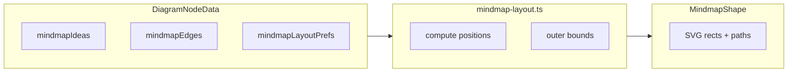

# Mind map — implementation specification

Authoritative specification for a new **`generic.object.mindmap`** compound shape in DiagramWeaver: structured **ideas**, internal graph **edges**, **dynamic layout**, and **connected colour themes**. This file is **design-only** — it does not implement the feature.

---

## 1. Goals and non-goals

### Goals

- New palette object **Mind map** (`generic.object.mindmap`) as **one** [`DiagramNodeData`](src/lib/types.ts) on the canvas (consistent with how [`generic.object.timeline`](src/lib/timeline-layout.ts) wraps spine + cards).
- **Ideas** are child records inside that node (each renders like a **rounded rectangle**: reuse typography, borders, fills, shadows — same spirit as [`RoundedRectangleShape`](src/components/diagram/shapes/rounded-rectangle.tsx) / [`SvgShapeBase`](src/components/diagram/shapes/svg-shape-base.tsx)).
- **Dynamic layout**: positions recomputed from the idea graph (see §6). First idea alone: no edges. Adding a second idea with a link from the first yields an automatic arrangement; a hub with three satellites places them on a circle around the hub (spacing tunable).
- **Add / remove** ideas and **edges** between ideas (including peer-to-peer), with UI consistent with the app’s minimal chrome.
- **Connected colour themes:** background and outline hues shift with **graph neighbourhood** — new ideas pick up a coherent palette derived from ideas they connect to (see §5), aligned with app themes (compare timeline [`timelineCardFillMode: 'theme-hues'`](src/components/diagram/shapes/timeline.tsx)).

### Non-goals (initial phase)

- Treating each idea as a separate top-level canvas node with [`DiagramConnectionData`](src/lib/types.ts) edges (possible future “explode” feature; avoids connection routing, grouping, and slide propagation complexity now).
- Full graph-theoretic layout parity with dedicated tools (e.g. Graphviz-level crossing minimization) unless added in a later phase.

---

## 2. Why a compound node (recommended)

| Approach | Pros | Cons |
|----------|------|------|
| **A. Compound node** (timeline-like) | Single id; JSON/import stable; layout owned by one module; no global connection clutter; viewer/editor share [`DiagramNode`](src/components/diagram/diagram-node.tsx) path | Internal edges are **not** [`CanvasConnections`](src/components/editor/canvas-connections.tsx); custom hit-testing and props panels |
| **B. Many canvas nodes + group** | Reuses Bezier/orthogonal connections | Auto-layout fights absolute canvas coords; move/duplicate/delete semantics harder; export noise |

**Recommendation:** **A** — structured arrays on the node + pure layout in `src/lib/mindmap-layout.ts` + renderer `src/components/diagram/shapes/mindmap.tsx`.

---

## 3. Data model

Extend [`DiagramNodeData`](src/lib/types.ts) (and [`DiagramNodeItem`](src/lib/types.ts) if ideas appear in slide copies — follow timeline field parity).

### 3.1 Idea record (`MindmapIdeaData`)

- `id: string` — stable uuid or sequential slug; never reuse after delete (avoids stale edge refs).
- `label?: string`, `richLabel?: RichTextRun[]` — align with timeline entries ([`TimelineEntryData`](src/lib/types.ts)).
- Visual overrides (optional, inherited from parent when omitted): `width`, `height`, `cornerRadius`, `backgroundStyle`, `backgroundColor`, `backgroundColors`, `borderStyle`, `borderColor`, `borderColors`, `shadow`, `textColor`, etc.
- **Optional layout hints** (later phases): `pinned?: boolean`, `angleBias?: number` (radians), or relative `x/y` when layout mode is `manual`.

### 3.2 Edge record (`MindmapEdgeData`)

- `id?: string`
- `from: string`, `to: string` — idea ids.
- Optional styling: `lineWidth`, `lineType`, `color`, `toArrow`, `fromArrow` (subset of [`DiagramConnectionData`](src/lib/types.ts); omit animation fields until needed).

### 3.3 Node-level preferences (`MindmapLayoutPrefs`)

- `mindmapRootId?: string` — default: **first created** idea; user can “set as center” later.
- `mindmapLayoutMode?: 'radial' | 'force' | 'manual'` — ship **`radial`** first.
- `mindmapRingSpacingPx`, `mindmapMinRadiusPx`, `mindmapIdeaDefaultW/H`, `mindmapLinkCurvature` — spacing vs. label size.
- `mindmapEdgeStrokePx` — global fallback for internal edges.
- **`mindmapColorMode?: 'neutral' | 'theme-hues' | 'connected-blend'`** — interacts with §5 (`neutral` = parent styling only; `theme-hues` = stepped hues like timeline cards; `connected-blend` = hues biased by adjacent ideas).

**Merged visuals:** Mirror [`mergedTimelineEntryVisualNode`](src/lib/timeline-styling.ts) with `mergedMindmapIdeaVisual(parentNode, idea, resolvedColors)` where `resolvedColors` comes from **`resolveMindmapIdeaColors`** (§5).

### 3.4 Per-idea colour locking

- `mindmapIdeaColorLocked?: boolean` on an idea (or treat explicit `backgroundColor` / `borderColor` as “manual”) — when locked, skip automatic hue allocation so visual styling panel edits are respected.

### 3.5 Schema

Add Zod fields beside timeline blocks in [`src/lib/schemas.ts`](src/lib/schemas.ts); keep `validateAndConvertJson` behaviour consistent with existing diagrams.

---

## 4. Consistency with existing visuals

- **Cards:** Match rounded-rectangle semantics (gradient/frosted/dotted border). Extract shared presentation **only if** duplication exceeds ~40 lines; otherwise duplicate minimally inside `MindmapShape`.
- **Lines:** Stroke/dash/caps like timeline spine + connections ([`connectionStrokeDashFromLineType`](src/lib/utils.ts), theme-aware greys).
- **Text:** [`extractTextStylingFromNode`](src/lib/text-styling.ts) / [`getTextStylingCSS`](src/lib/text-styling.ts) where HTML overlays are used (follow timeline card patterns).

---

## 5. Connected theme / hue allocation

**Intent:** Linked ideas should feel **related** (analogous hues, shared lightness bands, or palette steps). New nodes pick up colours from **neighbours** (and optionally depth from root), preserving dark/light readability.

### Design principles

- **Derive at render time** from `(parent defaults, mind map graph, active UI theme)` so reconnecting edges updates colours; persist overrides only when the user locks or explicitly sets colours.
- **Reuse** [`DEFAULT_THEMES`](src/lib/theme-manager.ts) / built-in hues; implement OKLCH or HSL helpers in **`src/lib/mindmap-styling.ts`** (parallel to [`timeline-styling.ts`](src/lib/timeline-styling.ts)).

### Allocation strategies (`mindmapColorMode`)

1. **`theme-hues`** — Root uses first hue slot from the active diagram theme (or parent accent). Children by BFS depth + sibling index rotate through discrete hues (timeline `theme-hues` spirit). Peer-only links: blend endpoints or use an intermediate slot.

2. **`connected-blend`** — Adjacent ids from undirected `mindmapEdges`. **One neighbour:** hue shift (e.g. ±25° HSL) from neighbour’s resolved colours. **Several neighbours:** average in OKLCH (or HSL shortest arc), then **separation nudge** (min ΔHue or ΔE). **Isolated:** root seed or `theme-hues` slot 0.

3. **`neutral`** — All ideas inherit parent mind map styling only; no graph-based hue mutation.

### Outlines vs fills

- **Fill** follows allocation; **border** slightly darker/lighter or neutral — match [`RoundedRectangleShape`](src/components/diagram/shapes/rounded-rectangle.tsx).
- **Gradients:** `backgroundColors` as `[light, dark]` from resolved hue.

### Internal edges (optional)

- Stroke interpolated between endpoint card colours; defer if scope-heavy.

### Contrast

- Clamp lightness for readable default label text; fallback to theme surfaces if needed.

### API sketch

`resolveMindmapIdeaColors(args): { backgroundColor, borderColor, backgroundColors?, borderColors? }`

Inputs: parent node, ideas + edges, `ideaId`, resolved theme, `mindmapColorMode`. Memo inside `MindmapShape` per layout pass.

### Editor UX

- Mind map toggle: **Auto colours** vs **Manual** (optional lock-all / unlock-all).
- Per-idea **Reset to auto colours** clears lock and manual overrides.

---

## 6. Layout algorithms

### Phase 1 — Radial (MVP)

1. **Root** = `mindmapRootId` or earliest idea by creation order.
2. **Neighbours:** ideas sharing an edge with root (undirected adjacency for placement). Non-root edges: chords or short Beziers between computed positions.

**Placement:**

- **n** neighbours of root: `θ_i = base + 2π·i/n` (e.g. `base = -π/2`).
- `R = max(mindmapMinRadiusPx, f(maxLabelWidth, cardHeight, n))` with sublinear growth vs `n`.
- Positions in diagram space relative to `node.x`, `node.y` (like timeline absolute card centers).

**Secondary nodes:**

- **BFS layers** from root on rings `R_k`, greedy angular spacing.
- **Orphans / disconnected from root:** nearest-placed attachment UX or auto-edge to root — pick one product rule.

### Phase 2 — Force-directed (optional)

Springs + repulsion; cap iterations; optional snap to [`GRID_STEP`](src/components/editor/canvas-constants.ts).

### Phase 3 — Manual

Pinned positions; radial fills unpinned nodes only.

### Collision

2–4 pairwise separation passes on bounding circles — deterministic.

---

## 7. Bounding box and canvas integration

Precedent: [`computeTimelineOuterBounds`](src/lib/timeline-layout.ts) + [`timelineLiveLayoutDims`](src/components/diagram/diagram-node.tsx).

- **`computeMindmapOuterBounds(node, synth?)`** — union of idea boxes + padding + edge overshoot.
- **`measureNodeDims`** in [`canvas-constants.ts`](src/components/editor/canvas-constants.ts): special-case mind map → snapped bounds from outer union.
- **`diagram-node.tsx`**: memoized live dims; resize updates when card defaults or idea count changes.

**Drag:** Prefer **relative offsets per idea** inside the mind map anchor; on drag of whole node, update `node.x` / `node.y` only.

---

## 8. Interaction model

- **Selection:** Background → parent; **`mindmapActiveIdeaId`** for sub-selection (like `timelineActiveEntryId`).
- **Add idea:** Toolbar/context → new id; default **auto-link new idea to root** when graph was empty or single-node (confirm in UX review).
- **Remove idea:** Delete incident edges; re-layout.
- **Link / unlink:** Two ideas selected → toggle edge; no duplicate undirected pairs by default.
- **Edit label:** Double-click → timeline-style rich edit path (`timelineEntries` patterns).

**Viewer:** Same rendering with `isReadOnly`; disable internal edit affordances.

---

## 9. Editor plumbing checklist

| Area | Files |
|------|--------|
| Types | [`src/lib/types.ts`](src/lib/types.ts) |
| Schema | [`src/lib/schemas.ts`](src/lib/schemas.ts) |
| Utils | [`src/lib/utils.ts`](src/lib/utils.ts) — `isMindmapNodeType`; optional inclusion in `isShapeNodeType` |
| Layout + styling | **new** [`src/lib/mindmap-layout.ts`](src/lib/mindmap-layout.ts), [`src/lib/mindmap-styling.ts`](src/lib/mindmap-styling.ts) (`resolveMindmapIdeaColors`) |
| Shape | **new** [`src/components/diagram/shapes/mindmap.tsx`](src/components/diagram/shapes/mindmap.tsx); export [`shapes/index.ts`](src/components/diagram/shapes/index.ts) |
| Node shell | [`src/components/diagram/diagram-node.tsx`](src/components/diagram/diagram-node.tsx) |
| Canvas dims | [`src/components/editor/canvas-constants.ts`](src/components/editor/canvas-constants.ts) |
| Toolbar | [`src/components/editor/context-toolbar.tsx`](src/components/editor/context-toolbar.tsx) |
| Palette | [`public/resources/resource-generic.json`](public/resources/resource-generic.json) + icon under `public/generic/object/` |
| Scratch pad | [`src/components/editor/scratch-pad.tsx`](src/components/editor/scratch-pad.tsx) if modal editing needed |
| Props | Extend timeline-entry pattern to **selected idea** |

**Slides:** Mirror timeline entry copy semantics for `mindmapIdeas` / edges ([`onPropagateAddToLaterSlides`](src/components/editor/context-toolbar.tsx)).

---

## 10. Viewer and presentation

- [`ViewerCanvas`](src/components/viewer/) uses [`DiagramNode`](src/components/diagram/diagram-node.tsx) — mind map renders once the branch exists.
- Internal edges do not use `connectionRenderRevision`. Keep `<defs>` outside CSS-transformed groups if gradients animate ([`AGENTS.md`](AGENTS.md)).

---

## 11. JSON / backward compatibility

- Omitting new fields on old diagrams is valid.
- On implementation: semver patch bump per project rule; [`MEMORY.MD`](MEMORY.MD) note.

---

## 12. Risks and mitigations

| Risk | Mitigation |
|------|------------|
| Large graphs (~50+) slow SVG | Optional cap / simplify |
| Cycles | BFS with visited set |
| Text overflow | Ellipsis; optional auto height |
| Undo/redo | All updates via existing `setDiagramData` flows |
| Colour flicker on edge edits | Derived-at-render + OKLCH nudge; locks |

---

## 13. Phased delivery (implementation order)

1. **Scaffold:** types, schema, empty `MindmapShape`, palette asset, `measureNodeDims`.
2. **Radial layout + rendering:** rects + Bezier edges; **`resolveMindmapIdeaColors`** + `mindmapColorMode`.
3. **Editing:** add/remove/link, labels, root selection, auto/manual colour toggle, per-idea reset.
4. **Polish:** overlap separation, toolbar, slide duplication, optional edge gradients.
5. **Stretch:** force layout, manual pins, Mermaid export for debugging.

---

## 14. Housekeeping when coding

- Run `node scripts/bump-patch.mjs` once per task touching `src/` (see [`.cursor/rules/semver-patch-on-app-edit.mdc`](.cursor/rules/semver-patch-on-app-edit.mdc)).
- Update [`MEMORY.MD`](MEMORY.MD) and [`functions.md`](functions.md) if those files track features.
